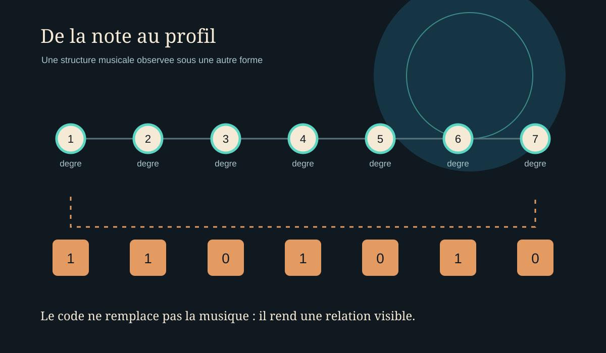
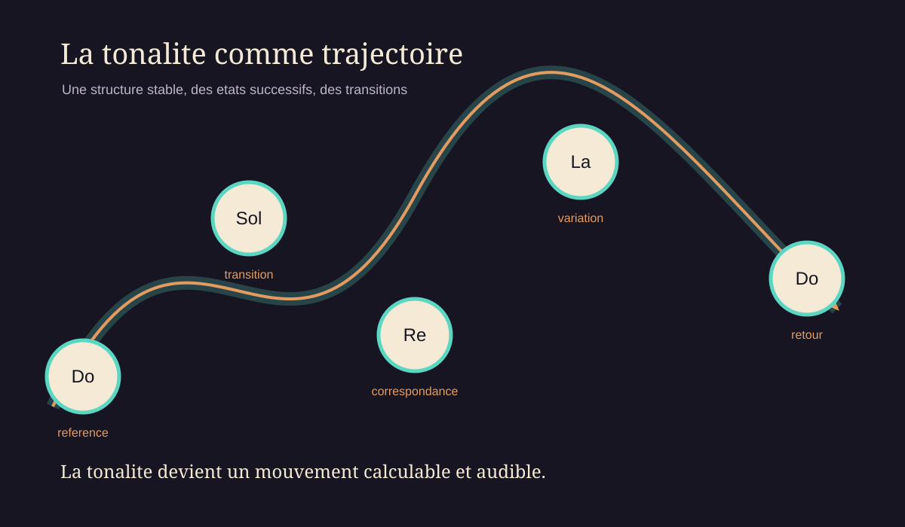
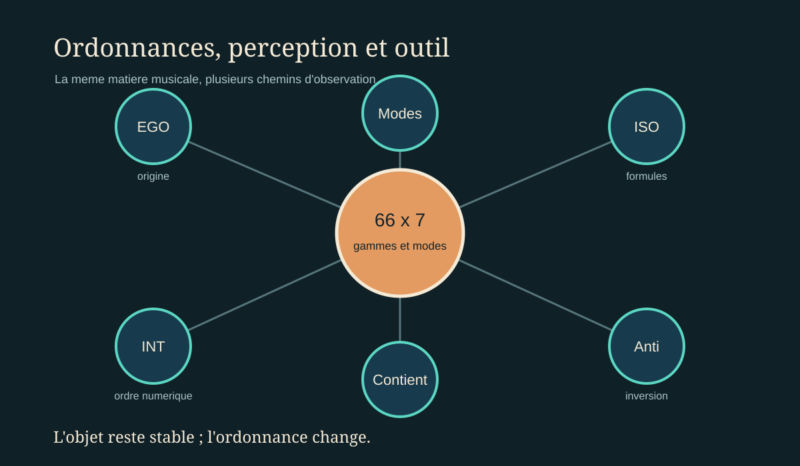

# Les sphères binaires

Ce texte est préparé pour les trois pages Cabviva consacrées aux sphères binaires. Les titres des premières sections sont conservés exactement ; le texte peut être remplacé ou enrichi dans l'éditeur du site.

---

## Page 1 — Les notes majeures binaires

# Les notes majeures binaires

La binarisation transforme une organisation musicale en une lecture de positions. Chaque degré est observé dans la structure traitée, puis traduit dans une forme numérique exploitable : position retenue ou position vide, `1` ou `0`.

Cette écriture ne prétend pas remplacer la note, le mode ou la tonalité. Elle isole une propriété de la structure afin de rendre visibles les ressemblances, les écarts et les répétitions entre les gammes. Le zéro n'est donc pas un vide absolu : il indique qu'une position n'est pas retenue dans le cadre choisi.

La binarisation est ainsi un changement de regard. La gamme n'est pas détruite par sa traduction numérique ; elle est observée sous une autre forme. Les notes deviennent des positions, les positions deviennent des profils, et les profils peuvent être comparés sans perdre leur origine musicale.

## Songammes : de la note au profil

Dans Songammes, la forme binaire appartient à une architecture plus vaste. Les données ne sont pas directement des fréquences : elles servent d'abord à organiser les degrés, les modes et les relations entre les 66 gammes fondamentales.

Chaque gamme possède sept modes diatoniques. Lorsqu'un mode est parcouru, sa structure peut être représentée par une suite binaire de sept positions. Cette suite devient une empreinte : elle permet de retrouver les gammes qui partagent une même organisation de degrés.

Le geste est à la fois musical et mécanique. Une position est retenue, déplacée, comparée ou regroupée. La gamme devient un objet en mouvement, non parce que ses notes cessent d'exister, mais parce que leur ordre d'observation change.

L'image binaire agit alors comme une carte. Elle ne dit pas tout de la musique ; elle rend visible une relation précise, celle qui permet au système de parcourir et de comparer les structures.

---

## Page 2 — Les tonalités dynamiques

# Les tonalités dynamiques

L'algorithme distingue deux niveaux. Certaines données restent stables : les relations binaires, les degrés et les structures comparées. D'autres données peuvent varier : la tonalité, l'ordre du parcours et la position d'écoute.

La lecture statique rapporte les gammes à une tonalité de référence, généralement Do. Cette stabilité facilite la comparaison. La lecture dynamique met en mouvement cette référence : la tonalité d'une gamme peut dépendre des correspondances découvertes avec la gamme précédente.

La tonalité n'est donc plus seulement un état fixe au début de la lecture. Elle devient le résultat d'une relation. Une gamme conduit vers une autre, et les points communs entre elles peuvent déterminer la continuité du parcours.

Ce mouvement ne constitue pas une simulation complète d'un instrument ou d'un espace acoustique. Il s'agit d'une règle musicale et algorithmique : conserver une structure lisible tout en faisant varier son contexte tonal.

## La tonalité comme trajectoire

La dynamique introduit une idée mécanique dans la théorie musicale : une gamme n'est pas seulement située, elle est engagée dans une trajectoire.

Le système conserve une couche structurale, composée des degrés et des profils binaires. Par-dessus cette couche, il calcule une succession de tonalités. L'invariant donne la forme du mouvement ; la variation lui donne une direction.

Lorsque deux gammes possèdent des correspondances, la transition peut conserver une continuité perceptible. Lorsqu'aucun lien suffisant n'est trouvé, le parcours revient à la référence. Ce retour n'est pas un échec : il marque la limite de la relation calculée et fournit un nouveau point de départ.

La physique fournit ici une analogie prudente. Une trajectoire musicale n'est pas une particule et une tonalité n'est pas une force au sens mécanique. Mais le vocabulaire du mouvement aide à comprendre ce que l'algorithme rend visible : une structure stable, des états successifs et des transitions déterminées par les relations.

---

## Page 3 — Une branche d'exploration — les modes binarisés

# Une branche d'exploration — les modes binarisés

Les modes binarisés constituent une branche d'exploration parmi les différentes manières d'organiser les gammes. La binarisation est appliquée aux 66 gammes fondamentales et à leurs sept modes diatoniques.

Six boutons organisent les principales orientations du parcours : EGO, Anti-EGO, ISO, Anti-ISO, INT et Anti-INT. Ils ne créent pas de nouvelles gammes. Ils changent l'ordre selon lequel les structures existantes sont consultées.

L'ordre EGO part de la gamme naturelle. L'ordre ISO s'appuie sur les formules numériques préparées dans `globdicTcoup.txt`. L'ordre INT trie les valeurs selon une progression numérique, dans un sens ou dans l'autre.

La même matière musicale peut donc apparaître sous plusieurs perspectives. L'objet reste stable ; l'ordonnance change.

## Ordonnances, perception et outil

Songammes transforme cette branche théorique en instrument d'exploration. L'utilisateur choisit une gamme ou un mode binaire, puis observe comment celui-ci se situe dans les différentes ordonnances.

Trois formes de traitement complètent cette lecture :

- `Modes` travaille sur les profils binaires des modes ;
- `Gammes` travaille sur les formes enumerees des gammes ;
- `Contient` transforme les formes enumerees en quantites d'intervalles.

La mécanique de l'application consiste à changer de représentation sans perdre la correspondance entre les données. Une même structure peut être nommée, énumérée, binarisée, regroupée ou ordonnée. Chaque opération révèle une relation différente.

La perception intervient lorsque la structure devient parcours. L'écran montre les positions ; l'oreille reçoit les fréquences. Le passage du tableau au son relie une géométrie discrète à un phénomène continu : la vibration.

C'est dans cet écart que se situe l'art quantique de la théorie musicale : non pas dans l'affirmation que la musique serait littéralement une mécanique quantique, mais dans l'exploration de correspondances entre états, transformations, relations et perceptions.

## L'ombre physique de la structure

Le passage au son s'appuie sur le tempérament égal : une octave double la fréquence et chaque demi-ton multiplie la fréquence par `2^(1/12)`, à partir de la référence du La 440 Hz. Les octaves et les fréquences donnent ainsi une dimension continue aux positions discrètes du tableau.

Songammes ne produit pas un son instrumental complet. La lecture utilise une onde sinusoïdale mono, échantillonnée à 44 100 Hz, avec une amplitude maximale d'environ 0,5 modulée par le volume. Un fondu linéaire d'environ 5 ms limite les coupures abruptes.

Cette simplicité est un choix d'observation. Il n'y a ni timbre de piano, ni résonance de salle, ni simulation de propagation. La sinusoïde laisse au premier plan les hauteurs, les écarts, les changements de tonalité et les relations entre les degrés.

La physique n'est donc pas ici une décoration ajoutée au calcul. Elle est le second versant de l'expérience : la structure est discrète dans le code, continue dans la vibration et perceptible dans l'écoute.

