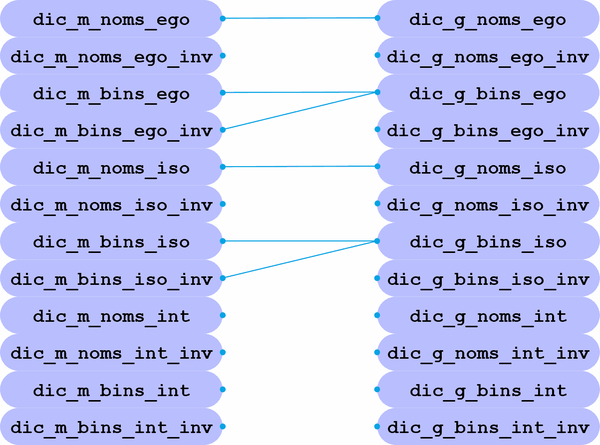

# Songammes

Songammes est une application Python de visualisation et d'écoute des gammes diatoniques. Elle organise 66 gammes fondamentales et leurs sept modes, puis permet de les parcourir selon plusieurs ordres de tri et de lecture.

Pour comprendre le lien entre les structures numériques, les fréquences et la génération sonore, consulter [le contexte physique de Songammes](CONTEXTE_PHYSIQUE.md).

Pour utiliser l'interface pas à pas, consulter le [manuel d'utilisation](MANUEL_UTILISATION.md).

## Démarrage rapide

### Prérequis

- Python 3.12 ou une version compatible
- Un environnement audio fonctionnel
- Windows, pour la gestion actuelle de l'audio et de l'interface

### Installation

Depuis le dossier du projet :

```powershell
python -m venv .venv
.\.venv\Scripts\Activate.ps1
python -m pip install --upgrade pip
python -m pip install numpy Pillow PyAudio
```

### Lancement

```powershell
python songammes.py
```

Le dossier courant n'est pas nécessairement le dossier du projet : les fichiers de données et les images sont résolus depuis le dossier de `songammes.py`.

## Utilisation

L'interface propose :

- des boutons horizontaux pour sélectionner une gamme ;
- des boutons verticaux pour sélectionner un mode binaire ;
- les traitements `Modes`, `Gammes` et `Contient` ;
- les organisations `EGO`, `ISO` et `INT`, avec leurs inversions ;
- une tonalité statique en Do ou une tonalité dynamique ;
- une lecture audible ou silencieuse ;
- un ordre de lecture par groupement, ordre diatonique ou fréquence.

La lecture audio utilise une onde sinusoïdale mono. Le code prépare un worker audio, mais le parcours actuel joue les notes directement pendant le traitement de l'interface ; l'interface peut donc rester occupée durant une lecture longue.

## Organisation du projet

| Fichier | Rôle |
| --- | --- |
| [`songammes.py`](songammes.py) | Interface Tkinter, calculs de présentation et orchestration de l'application |
| [`gammes_audio.py`](gammes_audio.py) | Transposition des gammes et préparation des séquences audio |
| [`globdicTcoup.txt`](globdicTcoup.txt) | 462 formules numériques utilisées par l'organisation ISO |
| [`gamme_majeure.txt`](gamme_majeure.txt) | 66 formes énumérées générées à partir des gammes majeures |
| [`CONTEXTE_PHYSIQUE.md`](CONTEXTE_PHYSIQUE.md) | Contexte physique, acoustique et numérique du fonctionnement sonore |
| [`MANUEL_UTILISATION.md`](MANUEL_UTILISATION.md) | Guide pratique de l'installation et de l'utilisation |
| `Bouton*.png` | Images des commandes de tri |
| [`armsph_5_1.png`](armsph_5_1.png) | Schéma des constitutions polaires |

## Modèle de traitement

Les trois organisations principales sont les suivantes :

- **EGO** : ordre construit à partir de la gamme naturelle ;
- **ISO** : ordre construit à partir des formules de `globdicTcoup.txt` ;
- **INT** : ordre numérique croissant ou décroissant.

Chaque organisation peut être considérée selon les noms des gammes ou selon leurs représentations binaires. Le traitement `Contient` transforme les formes énumérées en quantités d'intervalles.

## Vérification du projet

Pour vérifier la syntaxe et compiler tous les modules :

```powershell
python -m compileall -q .
```

Les fichiers de données et les images doivent rester à côté de `songammes.py`.

---

## Remarques importantes

Les traitements et les cumulations binaires restent liés aux structures de données historiques du projet. Les six images de tri permettent de choisir les organisations EGO, ISO et INT, ainsi que leurs inversions.

## Remarques historiques

L'application dans sa création a pris un tournant, du fait que composée de fonctions, elle a changé en classe.

## Quelle utilité pour cette application

Nous avons les boutons de la colonne des nombres entiers, et ceux de la barre horizontale des noms des gammes.

### Les boutons verticaux des binaires

Nous pouvons avoir des méthodes de lecture :
La méthode de lire à partir du bouton vertical parcourt les gammes qui utilisent ce bouton.
Par défaut, les gammes qui ont ce mode binaire dans leurs corps diatoniques sont parcourues selon l'ordre
des degrés. L'ordre effectif peut être groupé, diatonique ou hertzien.

1. [ ] Position du bouton-radio statique:
   1. Par défaut la gamme sélectionnée sera en DO (tout comme toutes les gammes qui ont été développées en DO).

2. [ ] Position du bouton-radio dynamique:
    1. Cette première gamme sert de référence à la mise en tonalité de la gamme suivante, la nouvelle tonalité

   dépendra des occurrences entre ces deux gammes voisines, ici, les lignes représentent les hauteurs tonales.

**On peut créer plusieurs genres de lecture.**

- Lecture des gammes ayant ce modèle binaire.
  - Cette lecture suit l'ordre affiché, le changement de gamme se fera en respectant la concordance de la tonalité.
  - Il y a plusieurs choix concernant les séquences de lecture :
    - Parcours complet en suivant l'ordre des degrés.
    - Lecture limitée à la ligne du binaire sélectionné.

### Les boutons horizontaux des gammes

Nous pouvons avoir des méthodes de lecture :
Tout comme les boutons verticaux, les boutons horizontaux peuvent lire les gammes qui ont les mêmes propriétés.

1. [ ] Position du bouton-radio statique:
   1. Par défaut la gamme sélectionnée sera en DO (tout comme toutes les gammes qui ont été développées en DO).

2. [ ] Position du bouton-radio dynamique:
    1. Cette première gamme sert de référence à la mise en tonalité de la gamme suivante, la nouvelle tonalité dépendra des occurrences entre ces deux gammes voisines, ici, les lignes représentent les hauteurs tonales.

**On peut créer plusieurs genres de lecture.**

- La lecture de la gamme peut se faire seule ou dans le parcours global.
  - Il y a plusieurs choix concernant les sens de lectures :
    - La gamme de bas en haut, de haut en bas, en suivant les degrés.
    - On peut aussi lire les gammes qui ont des correspondances binaires, selon l'ordre choisi.

#### Types de méthodes sur les gammes : Lorsqu'on appuie sur un bouton vertical ou horizontal

- La gamme a en commun six notes avec la gamme suivante, la tonique est la même.

- La gamme n'a pas de lien avec la suivante, la tonique devient en DO.

- La gamme a un lien avec la suivante, la tonique devient celle de la gamme suivante.

- La gamme a plusieurs liens avec la suivante, la tonique devient celle qui a le plus de notes communes.

### Boutons radios ajoutés

Couper le son du mode lecture

Choix de la polarité du traitement
Le pôle "Modes" exécute le tri classique réalisé sur les modes binarisés des gammes.
Le pôle "Gammes" exécute le tri sur les formes énumérées des gammes (modes toniques).
Le pôle "Contient" exécute une transition des formes énumérées en des quantités d'intervalles.

**Constitution des polarités.**


Aux premiers pas de cette application, seuls les degrés modaux étaient traités. Ce qui nous donnait six résultats
et maintenant, les gammes sous leurs formes énumérées sont traitées et elles apportent leur lot de nouveautés.
Ce n'est plus seulement six, mais douze éléments configurant douze listes particulières.

Ce nouveau traitement nous entraine à l'analyse des différentes listes.
Les listes (`_iso0` et `_iso1`) changent selon le choix (Modes, Gammes ou Contient). `self.zone_w4.get()`

- [EGO] = Organisation composée à partir de la gamme naturelle......... `self.gam_ego`
  - La méthode `Relance.gammes_arp()` produit les gammes à partir de la gamme majeure.
  - Elle est effective lors de l'appui sur les images _[modes[Tri_ego] et gammes[Tri_ego]]_.

- [ISO] = Organisation composée à partir du fichier `globdicTcoup.txt`. `self.gam_iso`
  - La méthode `Relance.gammes_log()` organise les gammes à partir du fichier `globdicTcoup.txt`.
  - **Rappel** : Contient les formes énumérées de la globalité des modulations diatoniques.
    - Cette séquence a été automatiquement établie dans un précédent algorithme basé sur les tétracordes.
  - Elle est effective lors de l'appui sur les images _[modes[Tri_iso] et gammes[Tri_iso]]_.

- [INT] = Organisation croissante ou décroissante des éléments.
  - Les valeurs issues de l'organisation ISO sont triées dans l'ordre croissant ou décroissant au moment de la sélection.
  - Les valeurs correspondent aux modes diatoniques utilisés par la lecture.

Nous avons finalement trois types de traitement `("Modes" ou "Gammes" ou "Contient")`.
Chacun d'eux a deux catégories, les noms des gammes énumérées et leurs modes binarisés.

Je rappelle que nous travaillons sur les soixante-six gammes primordiales et fondamentales, une gamme a sept notes diatoniques.

Dictionnaire des listes :
La liste des noms {`dic_noms_ego`, `dic_noms_ego_inv`, `dic_noms_iso`, `dic_noms_iso_inv`, `dic_noms_int`, `dic_noms_int_inv`}
Celle des modes {`dic_bins_ego`, `dic_bins_ego_inv`, `dic_bins_iso`, `dic_bins_iso_inv`, `dic_bins_int`, `dic_bins_int_inv`}
Chaque liste change en raison de son originale polarité `("Modes" ou "Gammes")`, ce qui donnera {`dic_m_bins_ego` ou `dic_g_bins_ego`}

La figure "constitutions polaires" comprend plusieurs égalités liées aux traitements.

_**TRAITS NOIRS**_ `dic_m_noms_ego` = `dic_g_noms_ego`. Puisque tous les deux sont issus de `def gammes.arp(self)`.
_**TRAITS BLEUS**_ `dic_m_bins_ego` = `dic_g_bins_ego`. Même ordre binarisé constaté.
_**TRAITS ROUGES**_ `dic_m_bins_ego` = `dic_m_bins_ego_inv`. L'ordre a seulement été inversé.
Les égalités baissent le nombre des différences, on sait que pour un [ISO], nous avons deux listes[noms, modes].

En comptant uniquement les différences, on obtient dix-sept marquages de modulations.

---

### La fonction clic_image

La liste selon '(self.dic_binary.keys())'.
La liste selon 'self.colonne_bin.copy()'.

## Méthodes du traitement des modes binaires

_Il existe une seule constance au démarrage, ce sont les modes naturels binaires._
_Les modes binaires sont issus du type classique des gammes primordiales, le type physique n’a pas encore été vu._
_'songammes' : Construit les gammes et les binaires selon le type classique = Dictionnaire alimenté par le fichier_
_'globdicTcoup.txt' : Une création des 462 formules numériques, exemple = '102034050607'._

### La méthode par défaut

Elle initialise les sept premières lignes de la colonne des modes binarisés.
Ensuite, elle fait un sondage sur les formes binarisées restantes et à venir,
pour définir quelle forme contient le plus de modes 'binaires' présents grâce aux modes déjà traités.

- Tel qu'il a été écrit à son départ, le traitement est en mode 'append()'

C’est ainsi, que grâce aux gammes fondamentales, la colonne des binaires a été remplie.

#### La méthode des entiers (Nombres entiers)

La liste originale des binaires a un ordre donné par **la méthode par défaut**.
En transformant le tri en ordre croissant remplace la séquence originale.
En inversant l'ordre croissant trié, on opère sur le tempérament original.

##### Le bouton ego et le bouton iso

- Ego est produit lors du traitement de l'application.

- Iso est produit à la préparation des données binaires.

##### Le bouton ego et le bouton iso, inversés

##### Les boutons int, l'un est ordonné et l'autre est inversé

- Int = Les données binaires ont été triées en ordre croissant et inversement.

---

### Les réglages

Choisir la tonalité statique ou dynamique à l'aide des boutons radio.

- Par défaut, la tonalité est statique et rapportée au Do.

Régler le volume.

- Curseur.

Choisir le mode de traitement : `Modes`, `Gammes` ou `Contient`.

- Les boutons radio déterminent la représentation traitée.

### Les lectures

Types : groupement, ordre diatonique ou ordre hertzien.
La lecture peut porter sur toutes les gammes ou sur une seule gamme.

- Ne lire que la ligne (binaire, gamme).

- Lire les gammes au même binaire.

- Lire les gammes aux mêmes degrés (binaires, gammes).

- Lire à partir de la sélection (binaires, gammes).

La lecture respecte l'ordre donné par les degrés. Des commandes permettent de lancer,
d'arrêter, reprendre ou réinitialiser la lecture.
